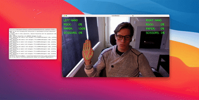

# Rock Paper Scissors



## Description

AI inference to determine if hands are making Rock, Paper, or Scissors.

## Setup

This code was written in 2021, so the dependencies are pretty old. I recomend you setup a virtual Python 3.8.10 environment, activate it, and then install the dependencies with:
```
pip install -r requirements.txt
```


## Usage

### Training

```
python3 livedatacollection.py
```
Press '1' to train Rock, '2' for Paper, and '3' for Scissors.

### Live Inference

```
python livedatainference.py
```


## Video Demo

Click [here](https://www.youtube.com/watch?v=lciTJ5YieNs) to watch the video on YouTube.
